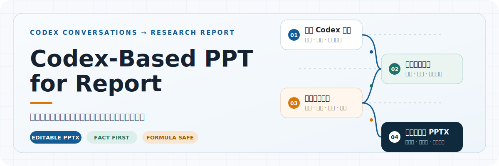
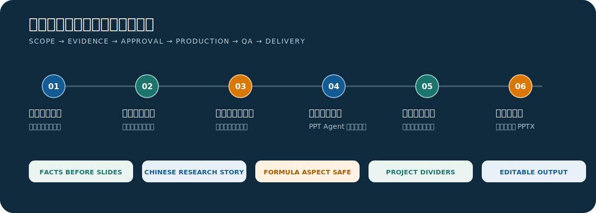

<p align="center">
  
</p>

<p align="center">
  <strong>把选定的 Codex 项目对话，转化为有事实边界、可编辑、可讲述的中文研究汇报。</strong>
</p>

<p align="center">
  双周研究进展 · 方法与实验方案 · 审稿返修计划 · 阶段成果总结 · 多项目组会
</p>

## 它解决什么

科研项目的进展通常散落在多个 Codex 任务中：方法为什么修改、实验怎样组织、哪些结果已经验证、哪些仍是计划。`codex-based-ppt-for-report` 先限定对话与时间范围，再确认事实依据和逐页结构，最后才进入演示文稿制作。

它不是把聊天记录压缩成幻灯片，而是把研究过程整理为一条可讲述的主线：

> 研究方向 → 修改内容与依据 → 实验组织 → 当前认识与边界 → 下一阶段工作

<p align="center">
  
</p>

## 核心原则

| 原则 | 具体行为 |
| --- | --- |
| 事实先于制作 | 先确认项目、日期、任务、事实摘要与冲突项，再生成演示文稿。 |
| 内容先于视觉 | 逐页大纲需要先获确认；不会让版式反过来决定研究结论。 |
| 研究语言面向听众 | 默认不把提交号、审查代码、开发门控和流水线细节堆进正文。 |
| 改动必须解释清楚 | 流程、目标函数、公式或实验方案发生变化时，说明修改前、修改后、依据、核心区别与影响。 |
| 公式必须可靠 | 优先使用可编辑公式；SVG 公式按 `viewBox` 等比缩放，禁止拉伸，并在导出后检查比例与排版。 |
| 多项目保持分章 | 每个项目是独立大章节，并在切换前加入明确而简洁的过渡页。 |
| 默认只留下成品 | 内部仍会完成证据核对、逐页渲染与 QA；除非明确要求，最终目录只保存 PPTX。 |

## 快速开始

将 Skill 复制到 Codex Skills 目录：

```powershell
Copy-Item -Recurse -Force `
  '.\skills\codex-based-ppt-for-report' `
  "$env:USERPROFILE\.codex\skills\codex-based-ppt-for-report"
```

重新打开相关 Codex 任务后，显式调用：

```text
$codex-based-ppt-for-report
```

一个完整请求可以这样写：

```text
使用 $codex-based-ppt-for-report，根据 TFS TSK-Ising 与 UC-FCM+ACSLL
两个 Codex 项目最近 14 天的对话，制作一份 20 分钟双周研究进展汇报。
重点说明目标函数和关键公式修改前后、修改依据与影响，采用视觉讲解型。
```

## 默认工作方式

1. 确认一个或多个 Codex 项目、时间范围、汇报类型和预计时长。
2. 列出候选 Codex 任务，仅在用户确认后读取任务正文。
3. 建立临时证据台账，区分已验证、未验证、计划、受阻、否决和待确认内容。
4. 提交事实摘要、冲突项与逐页大纲，等待确认。
5. 推荐并披露制作路径：PPT Agent、内置演示工具、`oil-ppt` 或明确说明的自定义流程。
6. 生成演示文稿，检查内容边界、章节过渡、公式比例、备注、溢出和视觉一致性。
7. 默认只交付 `<YYYY-MM-DD>_<汇报类型>.pptx`。

## 支持的汇报类型

- **双周研究进展**：研究方向、方法调整、实验组织、阶段性认识与下一周期计划。
- **论文方法与实验方案**：研究问题、方法机制、目标函数、实验设计与预期证据。
- **审稿意见与返修计划**：审稿问题、响应策略、证据、风险与后续动作。
- **阶段成果总结与下一步安排**：里程碑、已形成的认识、剩余缺口与决策点。
- **自定义汇报**：依据用途重新组织结构，同时保留事实边界与改动说明。

## 公式与视觉质量

公式优先使用可编辑数学对象；能力受限时使用 LaTeX 或 MathJax 生成的矢量公式。SVG 必须使用 `preserveAspectRatio="xMidYMid meet"`，按 `viewBox` 计算单一缩放系数并居中。导出后检查自然宽高比与显示宽高比，允许的相对误差不超过 1%。

所有页面都需要渲染后检查。标题采用简洁、自然的主题型表达；讲述句和汇报组织说明进入正文或演讲者备注。设计以白底、深灰和克制深蓝为基线，但可根据严谨学术型、视觉讲解型、决策讨论型或自定义倾向调整。

## 默认交付

```text
<YYYY-MM-DD>_<汇报类型>.pptx
```

用户明确选择离线 HTML 时，只交付对应的 `.html`。证据映射、QA 报告、渲染图、检查数据和源工程只在明确要求时保存。

## 项目结构

```text
skills/codex-based-ppt-for-report/
├── SKILL.md
├── agents/
│   └── openai.yaml
└── references/
    ├── conversation-evidence.md
    ├── content-architecture.md
    └── design-and-qa.md
```

README 视觉资源位于 `assets/readme/`。Skill 本体保持精简，只包含执行工作流所需的说明与参考文件。

## 使用边界

- 只读取用户确认的 Codex 任务，以及这些任务明确引用的本地材料。
- 不在未获允许时引入外部资料或扩大项目、任务与日期范围。
- 不把计划、假设或代理自述误写成已经完成并验证的研究结论。
- 不在未获明确许可时覆盖已有演示文稿。
- 任何未执行的检查都必须如实说明，不能写成已通过。
